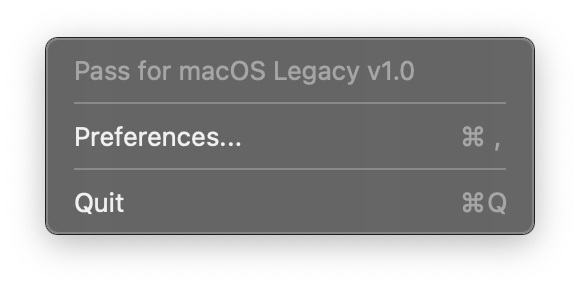
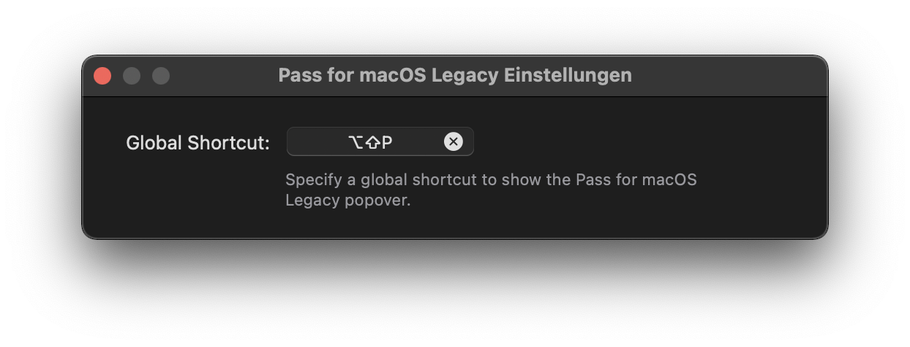

# Pass for macOS Legacy

> Pass for macOS Legacy is a macOS wrapper for zx2c4's `pass`, the standard UNIX password manager. It retrieves your decrypted passwords for the current domain and allows you to auto-fill login forms.

Pass for macOS Legacy consists of two parts.
First, a status bar app, which you can use to search passwords and copy them to the clipboard.
Second, a [Safari App Extensions](https://developer.apple.com/documentation/safariservices/safari_app_extensions) to auto-fill passwords in Safari using `pass`.

**Note: Pass for macOS Legacy is intended to be used on macOS 10.12 to 10.14.3. If you use a newer version of macOS, please use [Pass for macOS](https://github.com/adur1990/Pass-for-macOS).**

**Note: Pass for macOS does not come with its own pass installation, but assumes you have already `pass` installed somehow and it is in your `$PATH`.**

### Features
* Search any password from the macOS status bar.
* Copy any password to your clipboard for 45 seconds using the macOS status bar.
* Automatically search passwords for the current domain in Safari.
* Autofill passwords from the list of found passwords in Safari.

### Limitations
* The popover view in Safari can not be shown using the provided shortcut. Therefore, the first password for the current domain will be auto-filled if multiple exist.
* OTP is not supported.

## Table of Contents
* [Requirements](#requirements)
* [Installation](#installation)
* [Usage](#usage)
* [Contributing](#contributing)

## Requirements
* macOS 10.12, 10.13, 10.14 < 10.14.4
* `pass` and it's dependencies (i.e. `gpg`)
* A GUI-based pinentry. If the `gpg-agent` cache is empty, there is no way to enter a passphrase using a terminal based pinentry like `pinentry-tty` or `pinentry-curses`. `pinentry-mac` works great and can be installed using `brew install pinentry-mac`. After installing it, you have to enable it by `pinentry-program /usr/local/bin/pinentry-mac` to `~/.gnupg/gpg-agent.conf` file. Afterwards, reload you `gpg-agent` with `gpgconf --kill gpg-agent`.
* The first line of the password file has to be the password, the second line has to start with `login:`, `user:` or `username:`, followed by your username. All other lines after that are not considered. See the following example:

```
$ pass example.com
SuperSecurePassword
login: John Appleseed
```

### Dependencies
Pass for macOS Legacy relies on two dependencies:
* With [KeyboardShortcuts](https://github.com/sindresorhus/KeyboardShortcuts) by [Sindre Sorhus](https://github.com/sindresorhus) ([Their twitter profile](https://twitter.com/sindresorhus?lang=de)) it is possible to a) specify global shortcuts for apps and to b) let users record their own global shortcuts.
* [Preferences](https://github.com/sindresorhus/Preferences) by [Sindre Sorhus](https://github.com/sindresorhus) ([Their twitter profile](https://twitter.com/sindresorhus?lang=de)) lets developers create Preference windows easily.

## Installation
You have two options to use Pass for macOS Legacy: use the Github releases or build it yourself.

### Option 1: Use the Releases
Download the latest version of the app from the releases page and drop it in your applications folder.
Thats it.

### Option 2: Build it yourself
You can  build Pass for macOS Legacy yourself.
Here are the required steps.

#### Checkout and prepare
First, checkout this repository:

```
$ git clone git@github.com:adur1990/Pass-for-macOS-Legacy.git
```

Now, open the `passformacos.xcodeproj`, go to the General tab of `passformacos` target.
Here, check "Automatically manage signing" in the Signing section and select your own Team.
Do the same for the `extension` target.

Click on the build button and Pass for macOS Legacy will be build.
Congrats.
You can use your self-built Pass for macOS Legacy.

## Usage
You have to do two things to use Pass for macOS Legacy.
First, start the host app, which will run in background in your status bar.
Second, you have to enable the Safari extension in Safari's Preferences.

### The host app
Since Pass for macOS Legacy uses the host app to handle the security related password stuff, it has to run all the time.
However, to give it some meaning, a status bar item is added.

#### Status Bar


By clicking on the status bar item or using the defailt shortcut `shift-ctrl-p`, a popup will be shown containing a search field.
Here, you can search for password.
Selecting a search result by double-click or with enter will copy the password to the clipboard, exactly as `pass -c <password>` does.

#### Settings


For settings, the status bar item has a context menu with can be accessed using right-click.
Here, you can check the currently installed version, quit the app or open the app's preferences window.



Here you can record your own global shortcut for Pass for macOS Legacy.

### The extension
The extension has two modes.
You can click the toolbar item or use a shortcut.

#### Toolbar


When you click on the toolbar item, Pass for macOS Legacy will use the current domain and search your passwordstore for a matching password.
Double-clicking a found password or selecting it with arrow keys and return will autofill the login form.
If the password was not correctly found, you can refine the search using the search field.

#### Shortcut


Pass for macOS Legacy's Safari extension also offers a shortcut:

```
shift-alt-p
```

Unfortunately, prior to macOS 10.14.4 Apple did not offer an option to invoke the Safari toolbar popover when a shortcut is pressed (this is why two version of Pass for macOS exist).
Therefore, Pass for macOS will search a password containing the current domain as for the toolbar popover and autofill the first found password.
If you have multiple logins for a domain, only the first one will be used using the shortcut.
You will see a little notification on the top right if a password is auto-filled using the shortcut.

## Contributing
Any help is welcome, regardless if issue, pull request or comment.
Feel free to open issues if something happens, create pull requests if you have any fixes, updates or new features or ping me via mail if you have questions.
But please, be as precise as possible when creating issues.
Give me as much information as possible to make it possible for me to find, reproduce and fix your issues.
Finally, have a look into the [contribution guide](.github/CONTRIBUTING).

### Contributors
* Thank you, [jakajancar](https://github.com/jakajancar), for the [idea using a status bar host app](https://github.com/adur1990/Pass-for-macOS/issues/16) instead of a meaningless window app.
* Thank you, [rnkn](https://github.com/rnkn), for suggesting [renaming Passafari to Pass for macOS](https://github.com/adur1990/Pass-for-macOS/issues/20) and fixing the CONTRIBUTING markdown file.
